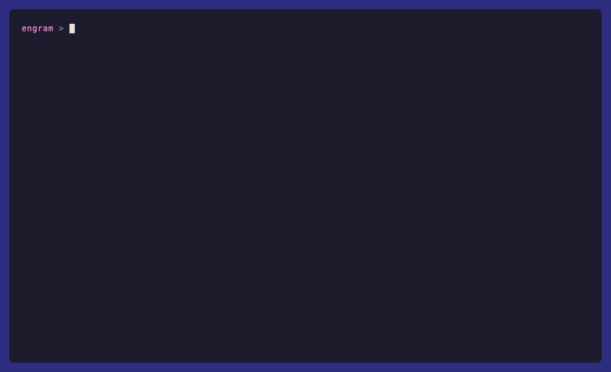
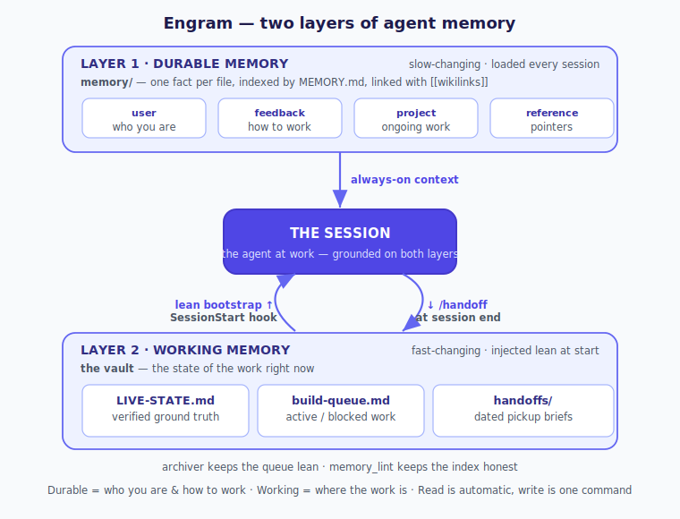

# Engram

**A persistent memory system for Claude Code, built on a plain Obsidian vault.**

[](https://github.com/ramennuts/Obsidian-Engram/actions/workflows/ci.yml)
[](LICENSE)
[](https://www.python.org/)


An *engram* is the physical trace a single memory leaves in the brain. This repo is
the same idea for a coding agent: a small, durable system that lets [Claude
Code](https://docs.claude.com/en/docs/claude-code) (or any agent that supports hooks
and skills) **resume work across sessions with full context** — instead of waking up
amnesiac every time.

No database, no embeddings, no paid APIs, no network calls. Just markdown, a couple of
hooks, two skills, and a few small scripts — organized into **two memory layers** with
clear jobs (durable facts vs. live working state) and the tooling to keep both sharp.

<p align="center">
  
</p>

---

## The idea

Most "agent memory" is either a giant context dump or a vector store you have to
operate. Engram is neither. It treats a few plain-markdown files as the memory spine
and automates the two moments that matter:

```
  ┌─ end of session ──────────────┐         ┌─ start of next session ──────────┐
  │  /handoff  →  writes a dense   │   ...   │  SessionStart hook  →  injects a  │
  │  handoff into the vault        │         │  LEAN bootstrap of current state  │
  └────────────────────────────────┘         └───────────────────────────────────┘
                     ▲                                          │
                     └──────── the same vault files ◄───────────┘
```

1. **Read on start — automatic.** A `SessionStart` hook injects a *lean* orientation:
   the latest handoff's open items + resume command, the live work-queue headers, and
   a table-of-contents of your ground-truth board. You never tell a session "go read
   the notes" — it already has them.
2. **Write on end — one word.** A `/handoff` skill writes a detailed, structured
   handoff (what shipped, why, dead-ends, open threads, gotchas, rollback, resume
   command) into the vault — which the hook then auto-loads next time.
3. **Stay lean — automatic.** A weekly script archives finished items out of the work
   queue so the injected context stays high-signal as the vault grows.

## Two layers of memory

Engram splits memory by **rate of change** — the thing that makes recall sharp and
context lean. (Full rationale in [docs/memory-architecture.md](docs/memory-architecture.md).)

<p align="center">
  
</p>

**Layer 1 — Durable memory** (`memory/`): facts true across *all* sessions — who you
are, your preferences, project context, references. One fact per file with typed
frontmatter (`user` / `feedback` / `project` / `reference`), indexed by `MEMORY.md`,
linked with `[[wikilinks]]`. Loaded every session; pruned/consolidated periodically.
Spec: [docs/memory-format.md](docs/memory-format.md) · starter: [`memory-template/`](memory-template).

**Layer 2 — Working memory** (the vault): the state of the work *right now* —
fast-changing, injected lean at session start.

| File | Role |
|------|------|
| `LIVE-STATE.md` | The **verified ground-truth board** — services, config, current state. When an older doc disagrees with it, you verify against the live system. It overrides stale notes. |
| `build-queue.md` | The **work queue** — `## Active items` (current work) and `## Blocked`. Finished items get struck and archived. |
| `handoffs/` | **Dated session handoffs.** The newest is the pickup brief. |

The rule of thumb: *"still true and useful three months from now in an unrelated
session?"* → durable. *"about what we're doing right now?"* → working.

## The full toolkit

| Piece | Layer | What it does |
|-------|-------|--------------|
| `hooks/session-start.py` | both | Injects a lean bootstrap (durable index is already loaded; this adds working state) at session start. |
| `skills/handoff/` | working | `/handoff` writes a detailed session handoff. |
| `skills/reflect/` | both | `/reflect` reviews recent work and *proposes* improvements to memory + workflow (never self-applies). |
| `scripts/archive_finished_queue.py` | working | Conservatively archives finished queue items. |
| `scripts/memory_lint.py` | durable | Checks the `memory/` dir for orphans, dangling links, and bad frontmatter. |
| `scripts/doctor.py` | both | Verifies the whole setup is wired correctly. |
| `hooks/guard.py` | both | Optional **rules-as-hooks** guard — makes a load-bearing rule deterministic instead of hoping the agent remembers it. |

Everything else in your vault/memory is yours, tied together with wikilinks. Engram only
owns the spine files and the tooling above.

## What's in this repo

```
engram/
├── hooks/
│   ├── session-start.py               # SessionStart hook — lean bootstrap injector
│   └── guard.py                       # optional rules-as-hooks PreToolUse guard
├── skills/
│   ├── handoff/SKILL.md               # /handoff — writes detailed session handoffs
│   └── reflect/SKILL.md               # /reflect — proposes improvements (never self-applies)
├── scripts/
│   ├── archive_finished_queue.py      # keeps the work queue lean (run weekly)
│   ├── memory_lint.py                 # checks durable-memory integrity
│   └── doctor.py                      # checks your whole setup is wired correctly
├── memory-template/                   # Layer 1 — durable-memory starter (index + examples)
│   ├── MEMORY.md
│   └── user_example.md  feedback_example.md  project_example.md  reference_example.md
├── vault-template/                    # Layer 2 — working-memory skeleton vault
│   ├── LIVE-STATE.md  build-queue.md  00-Index.md  CLAUDE.md
│   └── handoffs/2025-01-15-example-handoff.md
├── tests/                             # stdlib unittest — 29 tests across every tool
├── install.sh                         # one-command setup
├── settings.example.json              # env vars + hook registration
└── docs/
    ├── memory-architecture.md         # the two-layer model (start here)
    ├── memory-format.md               # the durable-note spec
    ├── principles.md                  # the six operating principles
    ├── design.md                      # the principles + the mistakes behind them
    └── architecture.svg               # the diagram above
```

Verify your install anytime with **`python3 scripts/doctor.py`**.

## Install (5 minutes)

```bash
git clone https://github.com/ramennuts/Obsidian-Engram.git ~/engram
cd ~/engram && ./install.sh            # seeds the vault + memory dir, installs the skills

# …or do it by hand:

# 1. Seed both memory layers:
cp -R ~/engram/vault-template  ~/vault     # Layer 2 — working memory
cp -R ~/engram/memory-template ~/memory    # Layer 1 — durable memory

# 2. Point Engram at them (add to your shell profile to persist):
export ENGRAM_VAULT="$HOME/vault"
export ENGRAM_MEMORY="$HOME/memory"

# 3. Install the skills:
mkdir -p ~/.claude/skills && cp -R ~/engram/skills/handoff ~/engram/skills/reflect ~/.claude/skills/

# 4. Register the SessionStart hook (and optionally the guard): merge the "hooks"
#    block from settings.example.json into ~/.claude/settings.json.

# 5. (optional) Run the queue archiver weekly. macOS launchd / cron, e.g.:
#    0 7 * * 1  /usr/bin/python3 ~/engram/scripts/archive_finished_queue.py --apply
```

Start a new Claude Code session — you should see the bootstrap context appear
automatically. Type `/handoff` at the end of a session to write the pickup brief for
next time.

> Paths in `settings.example.json` use `/Users/you/...` placeholders — set them to
> your real paths. The scripts read `$ENGRAM_VAULT` (default `~/vault`).

## Usage

- **During a session:** work normally. Reference and update `LIVE-STATE.md` /
  `build-queue.md` as state changes.
- **Finishing an item:** strike its queue header and add a marker —
  `### ~~Build the thing~~ — **DONE 2025-01-20**`. The archiver moves it later.
- **Ending a session:** type `/handoff`. It writes a detailed handoff and (if state
  changed) nudges you to update `LIVE-STATE.md`.
- **Keeping it lean:** run `archive_finished_queue.py` (dry-run by default; `--apply`
  to commit, always backs up first) — or schedule it weekly.

## Design principles (the short version — full notes in [docs/design.md](docs/design.md))

- **Lean injection.** Hook context has a hard size ceiling; over it, the harness
  silently truncates. Inject a summary + pointers, never whole docs.
- **Fail open.** A memory hook must never wedge a session — any error emits nothing
  and exits clean.
- **Conservative archiving.** Only archive items that are *unambiguously* finished;
  err toward keeping. A hidden live item is worse than a little clutter.
- **Verify against live.** The ground-truth board overrides stale docs; re-verify when
  big things ship.

## Why not just…

| Approach | Trade-off Engram avoids |
|----------|-------------------------|
| **A giant `CLAUDE.md` / always-on context** | Grows unbounded, goes stale, and costs tokens every turn. Engram injects a *lean, current* summary at session start and keeps the source files pruned. |
| **A vector DB / embeddings memory** | An extra service to run, embeddings to manage, and fuzzy recall. Engram is plain markdown you can read, grep, and edit — exact, inspectable, zero infra. |
| **Just paste a summary each session** | Manual, easy to forget, inconsistent. Engram automates the read end entirely and makes the write end one command. |
| **Let the agent re-read the repo each time** | Re-derives state it already figured out last session, and misses the *why* behind past decisions. Handoffs capture reasoning and dead-ends, not just code. |

## FAQ

**Does this only work with Claude Code?**
The `/handoff` skill and SessionStart hook use Claude Code's hook/skill format, but the
vault convention and the archiver are agent-agnostic. Any agent that can run a
start-of-session command and write files can use the same loop — adapters welcome.

**Do I have to use Obsidian?**
No. The vault is plain markdown; any editor works. Obsidian just makes browsing and
`[[wikilinking]]` notes pleasant, and the companion
[obsidian-skills](https://github.com/kepano/obsidian-skills) let the agent author
Bases/Canvas natively.

**Won't the injected context get huge over time?**
That's the failure mode Engram is built to prevent. The hook injects a *summary +
pointers* (a few KB, capped), not whole files, and the archiver keeps the work queue
trimmed. The full files are always one `Read` away when the agent needs detail.

**What if a vault file is missing or malformed?**
The hook fails open — it emits nothing and exits clean, so your session always starts.
Run `python3 scripts/doctor.py` to see what's wired and what's missing.

**How do I keep the queue from filling with finished items?**
Strike a finished item's header and add a marker (`### ~~Thing~~ — **DONE**`); the
archiver moves it to `Auto-archived` on its next run. It's conservative — anything with
an open thread, or merely "superseded," stays put.

## Requirements

- [Claude Code](https://docs.claude.com/en/docs/claude-code) (or another agent with
  SessionStart hooks + skills).
- Python 3 (standard library only — no pip installs).
- [Obsidian](https://obsidian.md) is optional — the vault is plain markdown and works
  with any editor; Obsidian just makes it nice to browse and link.

## Credits

Inspired by [@kepano](https://github.com/kepano)'s
[obsidian-skills](https://github.com/kepano/obsidian-skills) (great companion install
for authoring Bases/Canvas/Markdown natively). Engram is the memory-loop layer:
hooks + a handoff skill + a self-maintaining queue.

## License

MIT — see [LICENSE](LICENSE).
